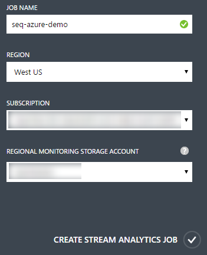
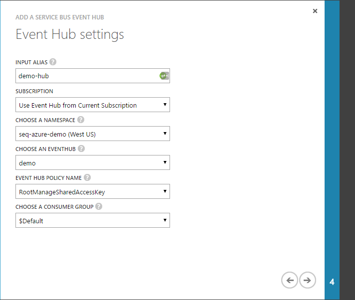
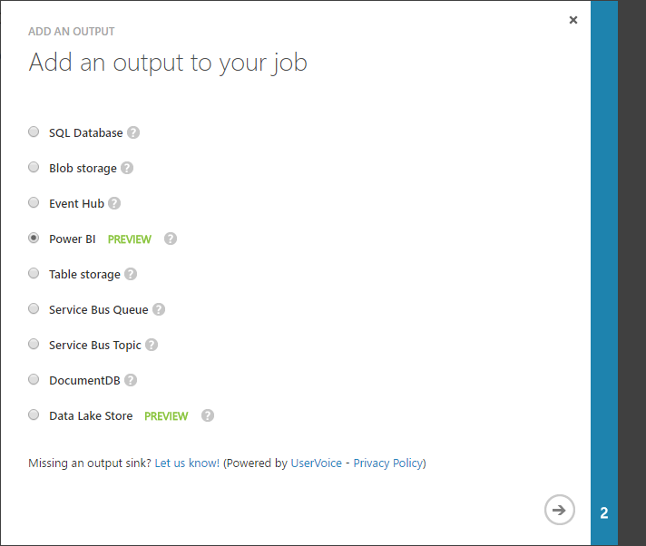
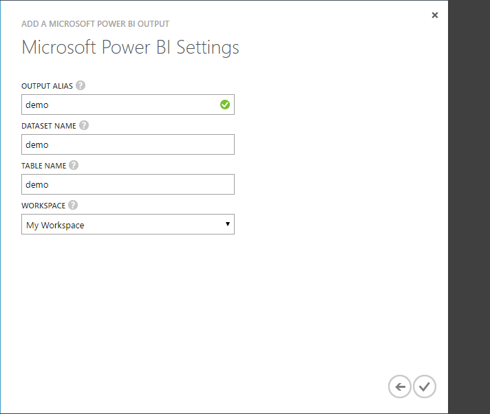

# Seq.App.Azure

Apps for the [Seq](http://getseq.net) event server. You can find installable versions of these by searching for the [seq-app tag on NuGet](http://www.nuget.org/packages?q=seq-app).

Currently in this repository you'll find:

 * **EventHub** - send Seq events to an Azure Event Hub.

## EventHub
The Seq.App.Azure.EventHub app can be used to send Seq events to an Azure Event Hub.  Once sent, you have many options regarding how you handle your log data.  One such option is Stream Analytics.  You can utilize Azure Stream Analytics to transport your event hub data to various ouputs like Microsoft's Power BI.  By sending your log data to Power BI, you can visualize your data in countless ways including dashboards, charts, cards, widgets, reports, and many more.

## Stream Analytics and Power BI
The following section walks you through setting up Stream Analytics with a Event Hub input and a Power BI output.

##1. Create a Service Bus
If you don't already have one, you'll need to create an Azure Service bus to house the Event Hub.

##2. Event Hub
###2a. Create Event Hub
Now you can create your Event Hub.  Name it whatever you like and is available.  It should be something meaningful to your project/application.

###2b. Configure a Shared Access Policy
Once the Event Hub is created, go over to the Configure tab and create a Share Access Policy.  This allows you to generate a connection string and send events to the hub.  You'll just need Send permissions.

###2c. Connection String
Now go back to the Event Hub Dashboard and get the connection string by clicking View Connection String then copy it to your clipboard.

##3. Configure Seq App
Next you'll need to configure the EventHub app in Seq.  Go to Settings->Apps and click Start New Instance under Azure Event Hub and set the properties similar to the following:

Once created, go back into the app instance and click the View events raised by this instance link to verify that it's working properly.

##4. Stream Analytics
###4a. Create Job
Now that you've verified that Seq is sending events to your Event Hub it's time to create a Stream Analytics job.

###4b. Add Input
Create an input for the Stream Analytics job.  The input will be the Event Hub you just created and are now sending Seq events to.

###4c. Add Output
Add an output.  For this example you'll create a Power BI output like so:

###4d. Create Query
Finally, create a Stream Analytics query to transfer data from the event hub to the Power BI output.

##5. Power BI
###5a. Dataset
Once Stream Analytics starts sending data to Power BI, the dataset will be automatically created for you as you can see below:

Click on the auto created data set to create a report:

Click the thumbtack to save the report and pin it to your dashboard:

###5b. Dashboard
Now you can view your report on the dashboard!

