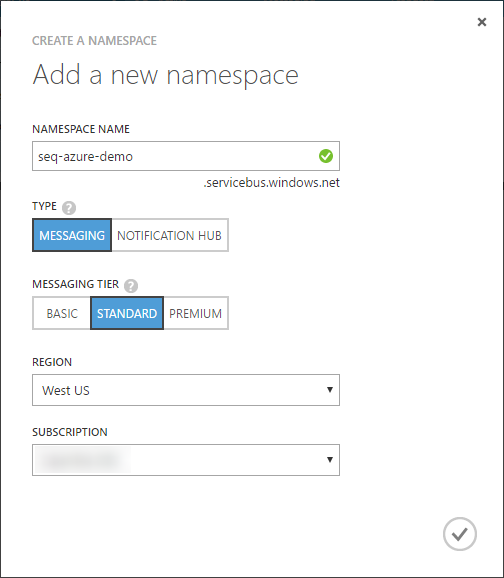
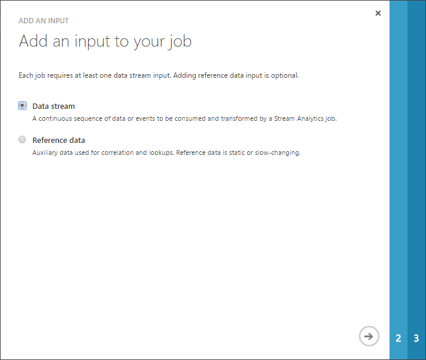
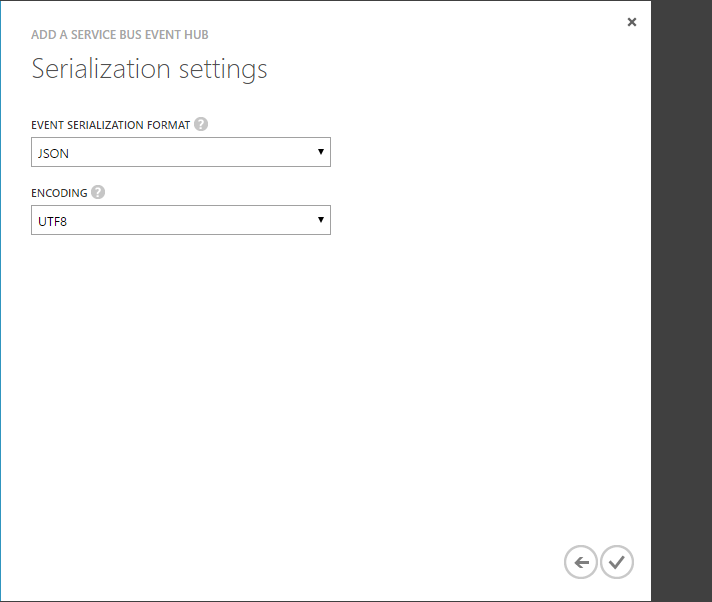
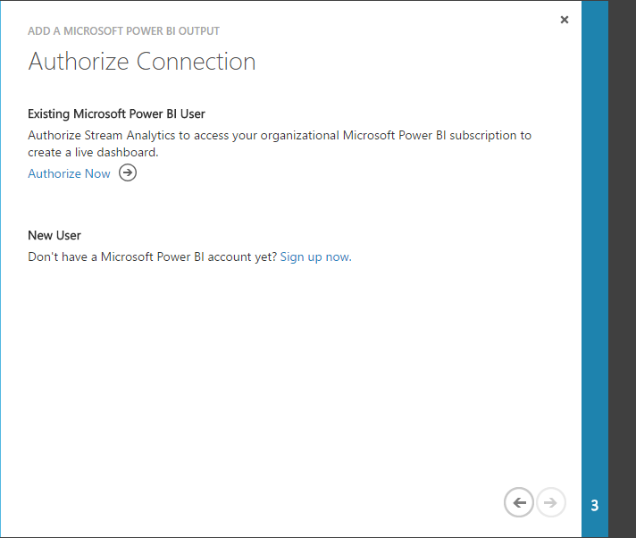
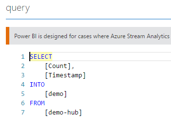
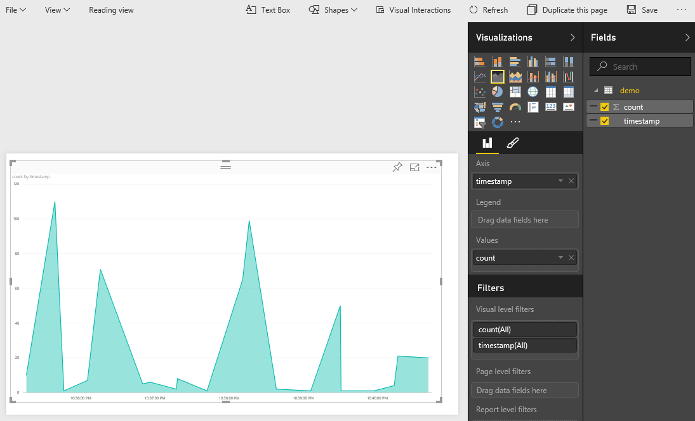
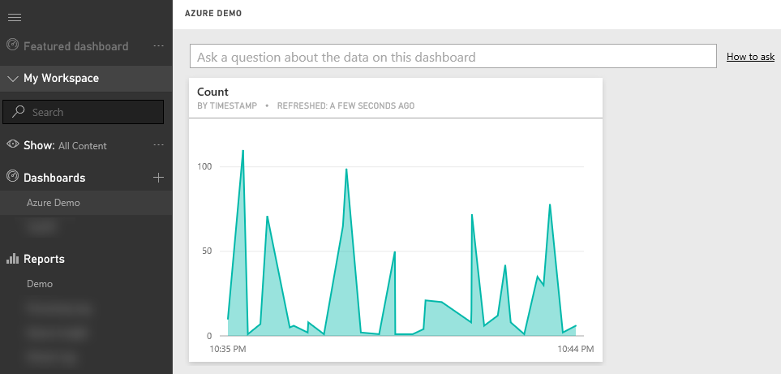

# Seq.App.Azure

Apps for the [Seq](http://getseq.net) event server. You can find installable versions of these by searching for the [seq-app tag on NuGet](http://www.nuget.org/packages?q=seq-app).

Currently in this repository you'll find:

 * **EventHub** - send Seq events to an Azure Event Hub.

## EventHub
The Seq.App.Azure.EventHub app can be used to send Seq events to an Azure Event Hub.  Once sent, you have many options regarding how you handle your log data.  One such option is Stream Analytics.  You can utilize Azure Stream Analytics to transport your event hub data to various ouputs like Microsoft's Power BI.  By sending your log data to Power BI, you can visualize your data in countless ways including dashboards, charts, cards, widgets, reports, and many more.

## Stream Analytics and Power BI
The following section walks you through setting up Stream Analytics with a Event Hub input and a Power BI output.

##1. Create Service Bus

##2. Event Hub
###2a. Create Event Hub

###2b. Configure Shared Access Policy

###2c. Connection String

##3. Configure Seq App

Verify that the app is sending events to Azure:

##4. Stream Analytics
###4a. Create Job

###4b. Add Input

###4c. Add Output

###4d. Create Query

##5. Power BI
###5a. Dataset
Once Stream Analytics starts sending data to Power BI, the dataset will be automatically created for you as you can see below:

Click on the auto created data set to create a report:

Click the thumbtack to save the report and pin it to your dashboard:

###5b. Dashboard
Now you can view your report on the dashboard!

